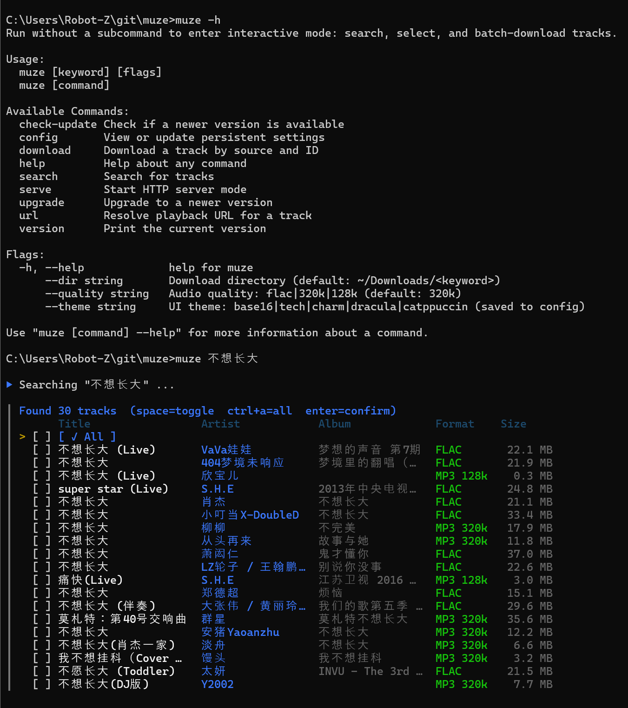
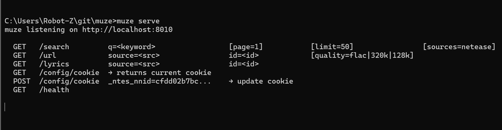

# muze

Go service and CLI for searching Chinese music platforms and resolving playback URLs.

## Demo

### CLI — interactive search & batch download


### HTTP — JSON API


## Install

```bash
curl -fsSL https://raw.githubusercontent.com/ropean/muze/main/install.sh | bash
```

Pin a specific version:

```bash
MUZE_VERSION=v0.0.3 curl -fsSL https://raw.githubusercontent.com/ropean/muze/main/install.sh | bash
```

## CLI

Run without arguments to enter interactive mode (search → select → download):

```bash
muze [keyword] [--dir <path>] [--theme base16|tech|charm|dracula|catppuccin]
```

Other commands:

```bash
muze search "keyword" [--page N] [--limit N] [--sources netease]
muze url netease <id> [--quality flac|320k|128k]
muze download netease <id> [--out path] [--quality flac|320k|128k] [--lyrics]
muze serve [--port 8010]
muze version
muze check-update
muze upgrade [--version v0.0.3]
```

`--theme` and `--dir` are saved to config and reused across sessions (`%AppData%\muze\config.json` on Windows, `~/.config/muze/config.json` on Linux/macOS).

## HTTP

Start the server:

```bash
muze serve [--port 8010]
```

Endpoints:

| Method | Path | Required | Optional |
|--------|------|----------|---------|
| GET | `/search` | `q=<keyword>` | `page=1` `limit=50` `sources=netease` |
| GET | `/url` | `source=<src>` `id=<id>` | `quality=flac\|320k\|128k` |
| GET | `/lyrics` | `source=<src>` `id=<id>` | |
| GET | `/health` | | |

**Quality options** (`flac` / `320k` / `128k`): optional, defaults to `320k`. Only applies to `/url` and `muze download` — search always returns metadata for the best available quality.

## Build

| Task | Makefile | Plain `go` |
|------|----------|------------|
| Build | `make build` | `go build -o muze .` |
| Serve | `make serve` | `go run . serve` |
| Test (all) | `make test` | `go test -race ./...` |
| Test (CLI) | `make test-cli` | `go test -race ./cmd/... ./internal/api/...` |
| Test (HTTP) | `make test-http` | `go test -race ./internal/server/...` |
| Format | `make fmt` | `gofmt -s -w .` |
| Lint | `make lint` | `go vet ./...` |

## Release

Pushing a tag triggers the GitHub Actions release workflow (6 platforms: linux/darwin/windows × amd64/arm64):

```bash
git tag v0.0.3
git push origin v0.0.3
```
